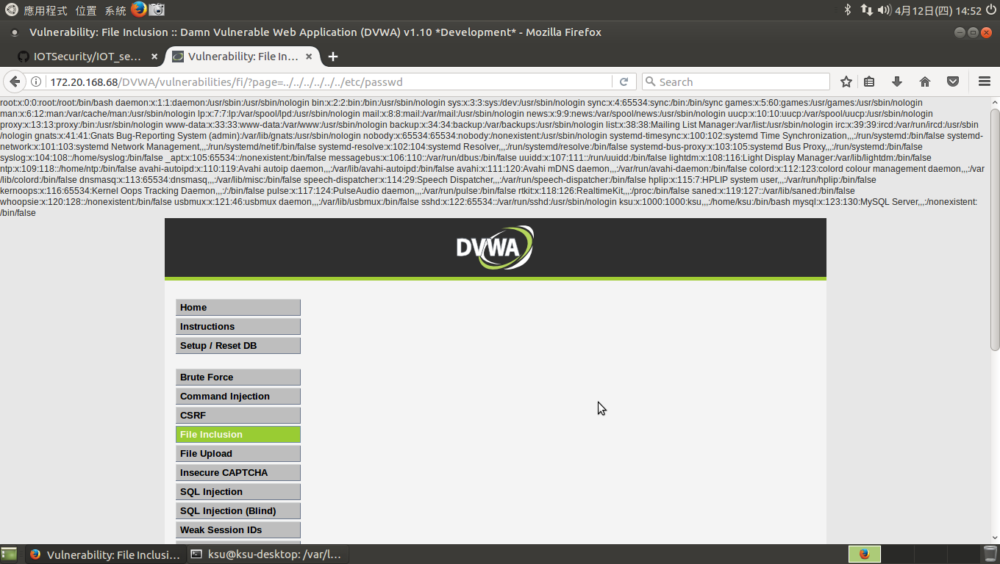
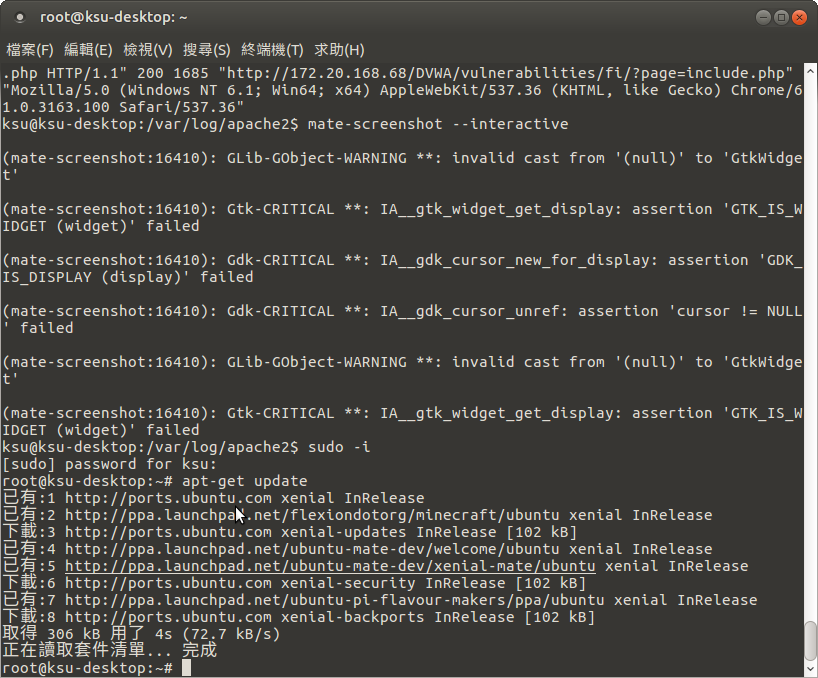

#### Web Attacks漏洞測試
Command Injection

SQL Injection
 
  
File Inclusion
 
#### 檢視apache web server的log檔
cat access.log
 
#### 安裝modsecurity

    sudo apt-get update
    sudo apt-get install libapache2-modsecurity -y
  
 
 

    sudo  service apache2 reload
    sudo apachectl -M | grep --color security2
  
 
檢視ModSecurity default rules
修改設定檔
  
  sudo vim /etc/apache2/mods-enabled/security2.conf    

#### Web RE-Attacks漏洞測試
  
