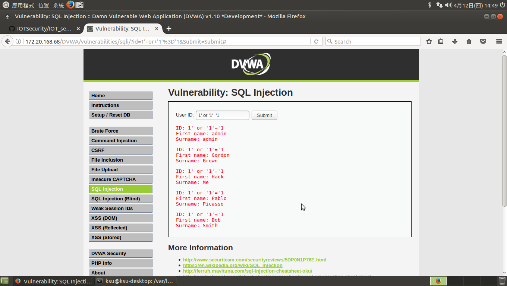
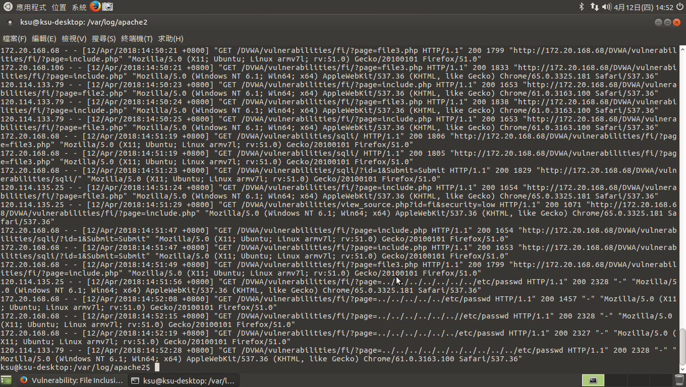

#### Web Attacks漏洞測試
Command Injection

SQL Injection

File Inclusion

#### 檢視apache web server的log檔
cat access.log

cat access.log
cat error.log
#### 安裝modsecurity
檢視ModSecurity default rules
修改設定檔
  
  sudo vim /etc/apache2/mods-enabled/security2.conf    

#### Web RE-Attacks漏洞測試
  
