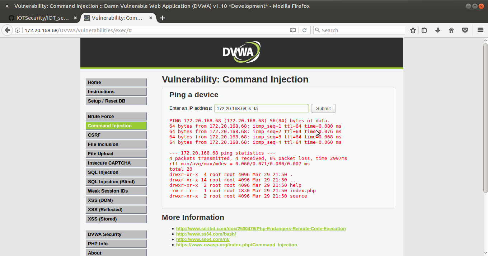
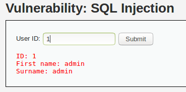
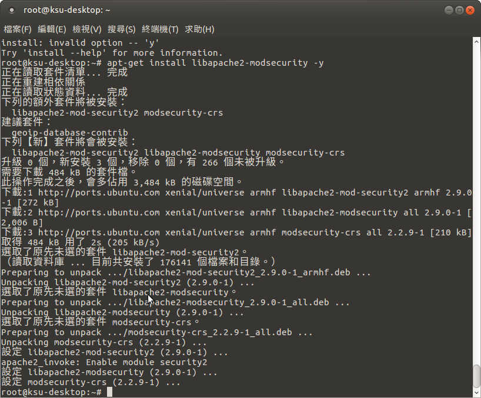
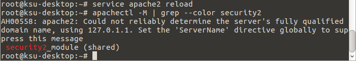
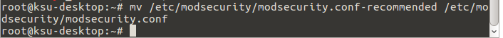
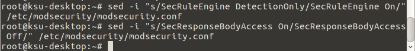
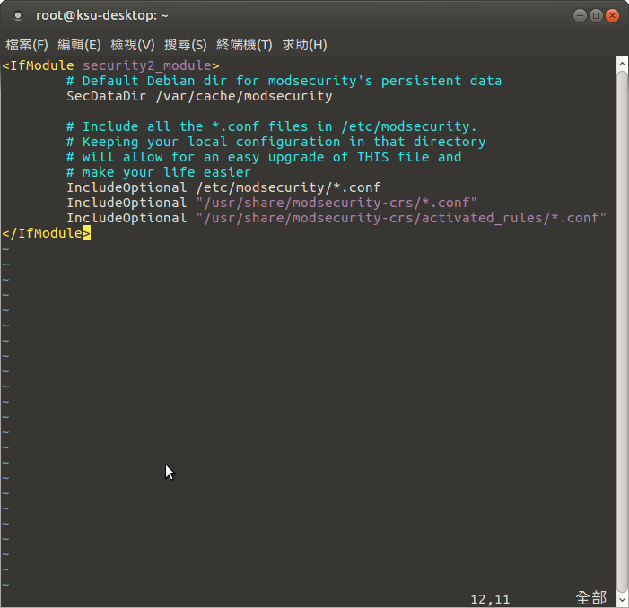
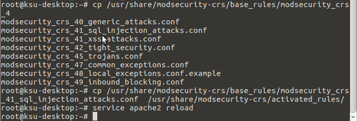
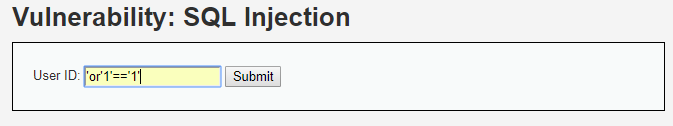

#### Web Attacks漏洞測試
Command Injection

SQL Injection
 
  
File Inclusion
 
#### 檢視apache web server的log檔
cat access.log
 
#### 安裝modsecurity

    sudo apt-get update
    sudo apt-get install libapache2-modsecurity -y
  
 
 

    sudo  service apache2 reload
    sudo apachectl -M | grep --color security2
  
 

    sudo mv /etc/modsecurity/modsecurity.conf-recommended /etc/modsecurity/modsecurity.conf
    
 

    sudo sed -i "s/SecRuleEngine DetectionOnly/SecRuleEngine On/" /etc/modsecurity/modsecurity.conf
    sudo sed -i "s/SecResponseBodyAccess On/SecResponseBodyAccess Off/" /etc/modsecurity/modsecurity.conf
    
 

    sudo vim /etc/apache2/mods-enabled/security2.conf

 

    sudo service apache2 reload
    sudo cp /usr/share/modsecurity-crs/base_rules/modsecurity_crs_41_sql_injection_attacks.conf /usr/share/modsecurity-crs/activated_rules/
    
 

#### Web RE-Attacks漏洞測試
 
 
