# **__安裝伺服器系統__**
> ## 安裝[JAVA8](http://www.oracle.com/technetwork/java/javase/downloads/jdk8-downloads-2133151.html) (Windows x64)
### 安裝好以後記得設定環境變數
`檔案總管 > 本機(右鍵) > 內容 > 進階系統設定 > 環境變數(N)... > 找到系統變數(Path) > 編輯(I)... > 新增Java路徑`
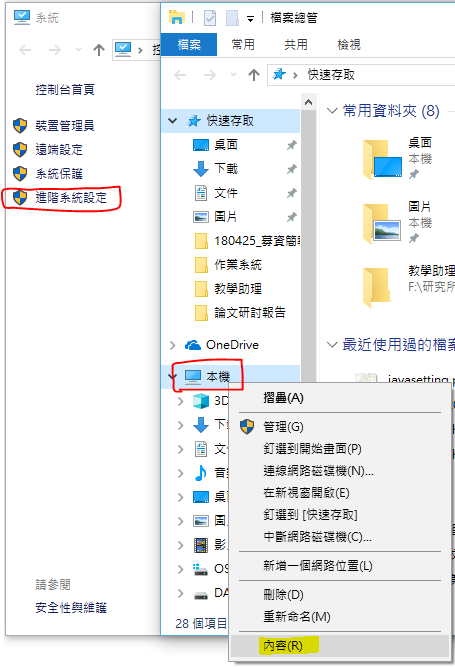
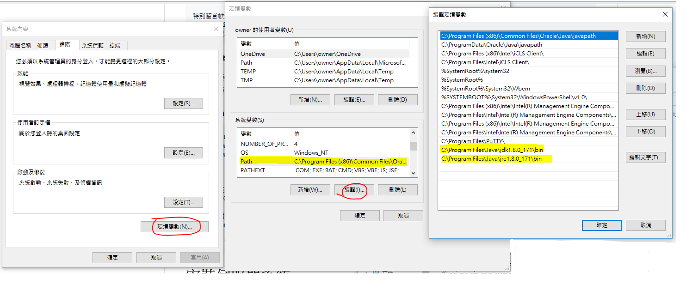
> ## 安裝[elasticsearch](https://www.elastic.co/downloads/elasticsearch) [ZIP]
### 進行解壓縮後將資料夾名稱改為 `elasticsearch` 並放置在C:\Program Files內
### 修改C:\Program Files\elasticsearch\config\ `elasticsearch.yml` 檔
    network.host: 0.0.0.0

### 執行C:\Program Files\elasticsearch\bin\ `elasticsearch.bat` 檔
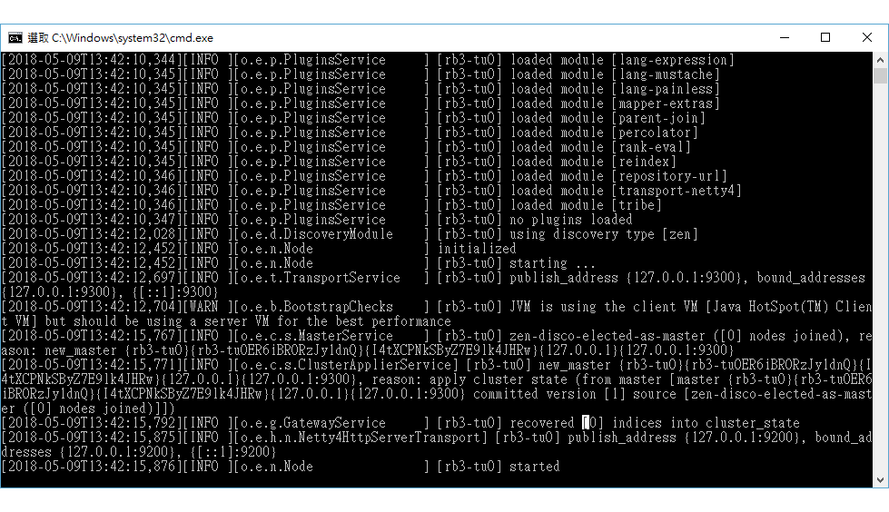
### 開啟網頁，在網頁輸入網址 `http://localhost:9200/`
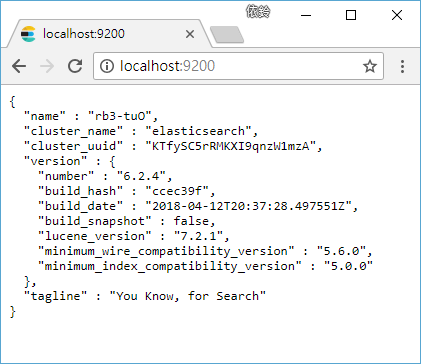
> ⚠若elasticsearch無法正確執行，請使用[msi安裝方法](https://www.elastic.co/downloads/elasticsearch) [MSI (BETA)]
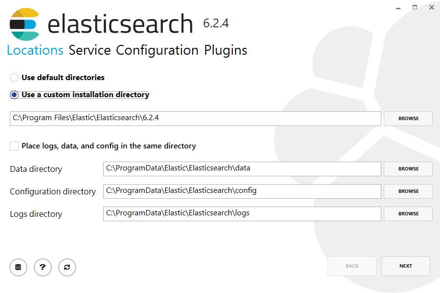
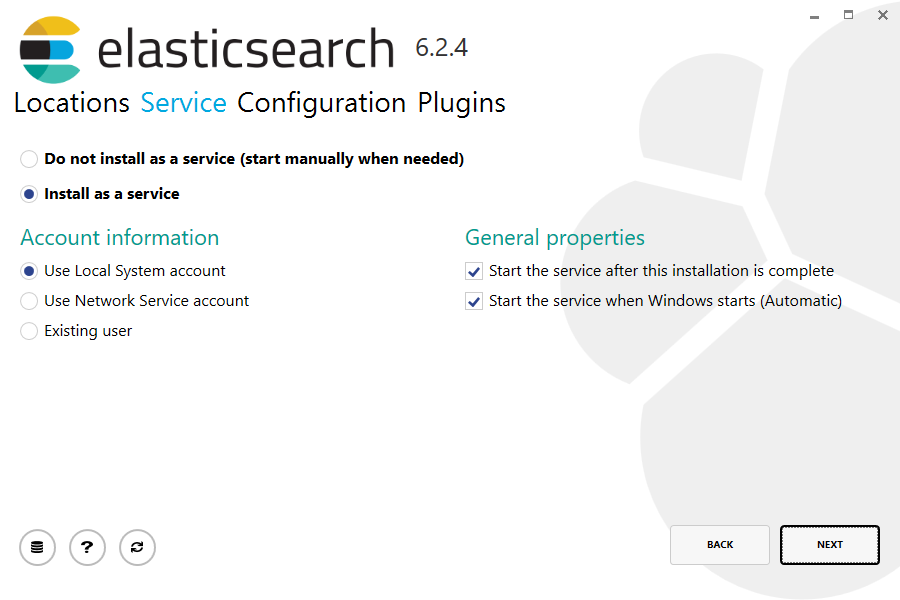

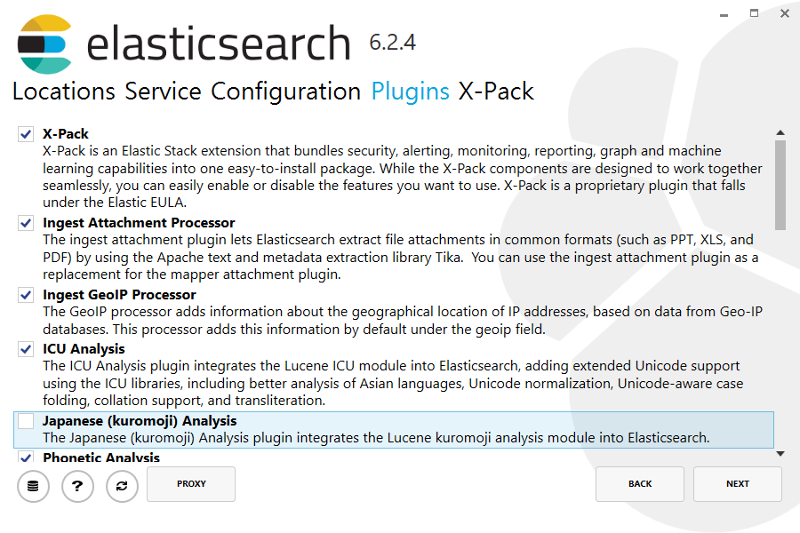
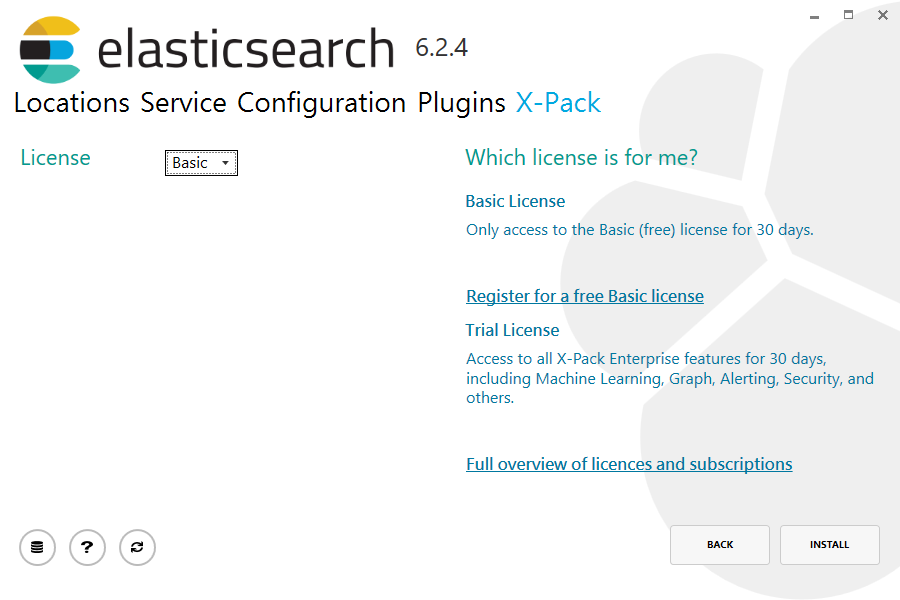                                 
### 執行C:\Program Files\Elastic\Elasticsearch\6.2.4\bin `elasticsearch.exe` 檔
### 開啟網頁，在網頁輸入網址 `http://localhost:9200/`
> ## 安裝[Kibana](https://www.elastic.co/downloads/kibana) (WINDOWS)
### 進行解壓縮後將資料夾名稱改為 `Kibana` 並放置在C:\Program Files內
### 修改C:\Program Files\kibana\config `kibana.yml` 檔
    server.host: "0.0.0.0"
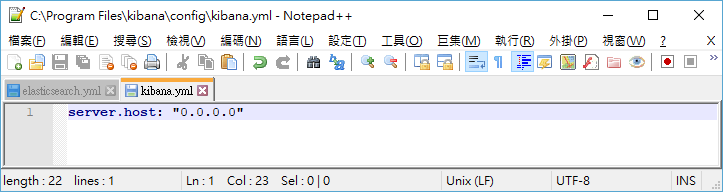
### 執行C:\Program Files\kibana\bin `kibana.bat` 檔
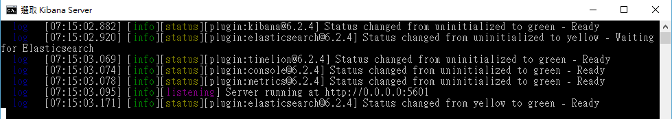
### 開啟網頁，在網頁輸入網址 `http://localhost:5601/`

> ## 安裝[Winlogbeat](https://www.elastic.co/downloads/beats/winlogbeat) (WINDOWS 64-BIT)
### 進行解壓縮後將資料夾名稱改為 `winlogbeat` 並放置在C:\Program Files內
>> ## 使用powershell`(以系統管理員身分執行)`安裝    
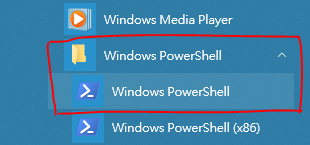

    Set-ExecutionPolicy RemoteSigned (y)
    cd 'C:\Program Files\Winlogbeat'
    .\install-service-winlogbeat.ps1

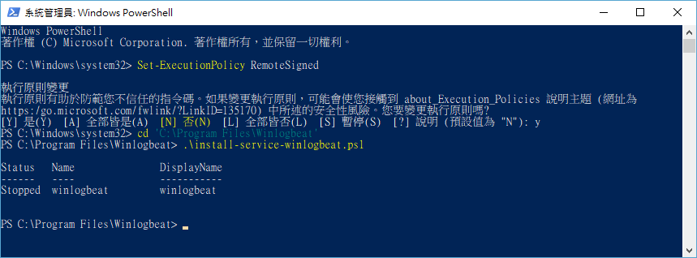
### 修改C:\Program Files\winlogbeat `winlogbeat.yml` 檔
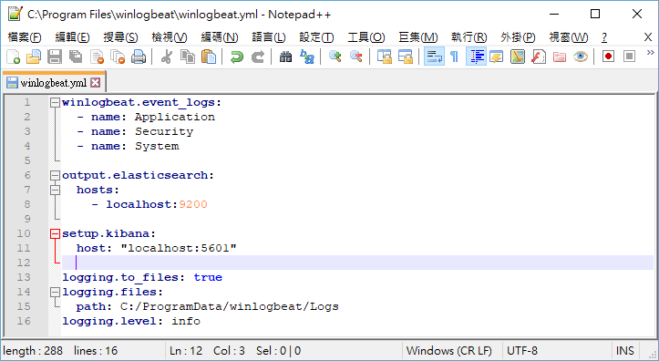

    .\winlogbeat.exe test config -c .\winlogbeat.yml -e
    .\winlogbeat setup --template -E output.logstash.enabled=false -E 'output.elasticsearch.hosts=["localhost:9200"]'

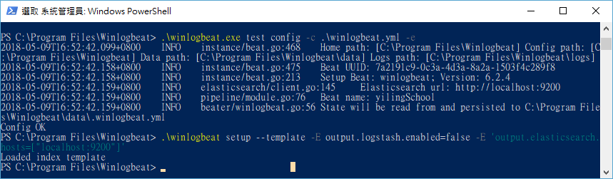
### 開啟網頁，在網頁輸入網址 `http://localhost:9200/winlogbeat-*`     
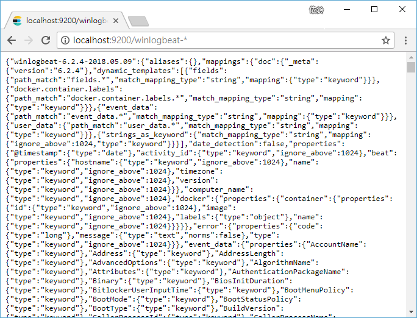

    .\winlogbeat setup --dashboards
    Start-Service winlogbeat
    
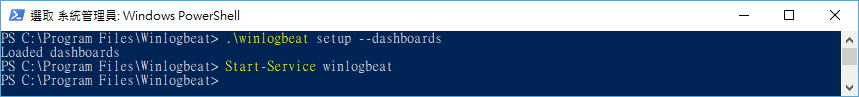
### 在網頁輸入網址 `http://localhost:5601/app/kibana#/discover?_g=()` 可看到資料傳輸成功
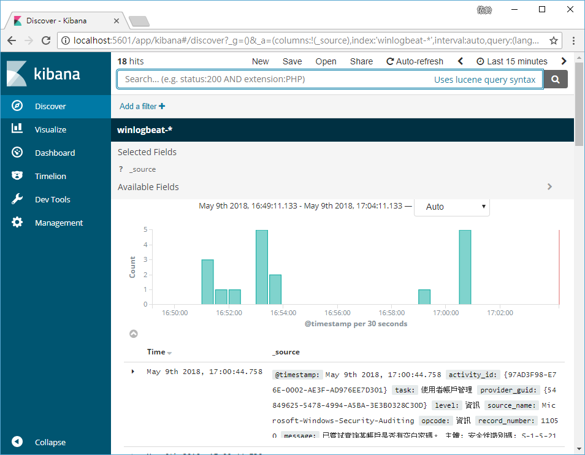
> ## 安裝 logstash@Ubuntu MATE (64-bit)

    sudo apt-get install openjdk-8-jre
    sudo apt-get install grok
    curl -L -O https://artifacts.elastic.co/downloads/logstash/logstash-5.2.0.zip
    unzip logstash-5.2.0.zip
    sudo mv logstash-5.2.0/ /opt
    cd /opt 
    sudo mv logstash-5.2.0/ logstash 

    sudo apt-get install ant texinfo openjdk-8-jdk build-essential
    git clone https://github.com/jnr/jffi.git
    cd jffi
    ant jar
    sudo cp build/jni/libjffi-1.2.so /opt/logstash/vendor/jruby/lib/jni/arm-Linux

    cd /opt/logstash
    sudo vim config/jvm.options
    
### jvm.options設定黨內容
    
    -Xms512m
    -Xmx512m
    
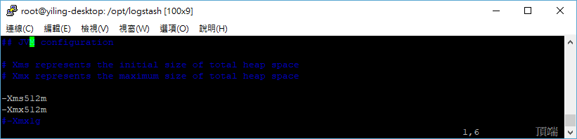

    cd /opt/logstash
    sudo vim apache-filter.conf 
    
### apache-filter.conf設定黨內容
    
    input {
      file {
        path => "/var/log/apache2/access.log"
        start_position => "beginning"
      }
    }
    filter {
      if [path] =~ "access" {
        mutate { replace => { "type" => "apache_access" } }
        grok {
          match => { "message" => "%{COMBINEDAPACHELOG}" }
        }
      }
      date {
        match => [ "timestamp" , "dd/MMM/yyyy:HH:mm:ss Z" ]
      }
    }
    output {
      elasticsearch {
        hosts => ["120.114.135.24:9200"]
      }
      stdout { codec => rubydebug }
    }    

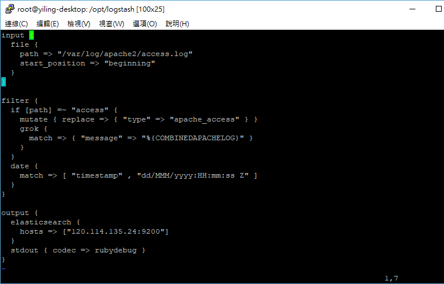

    sudo bin/logstash -f apache-filter.conf
    
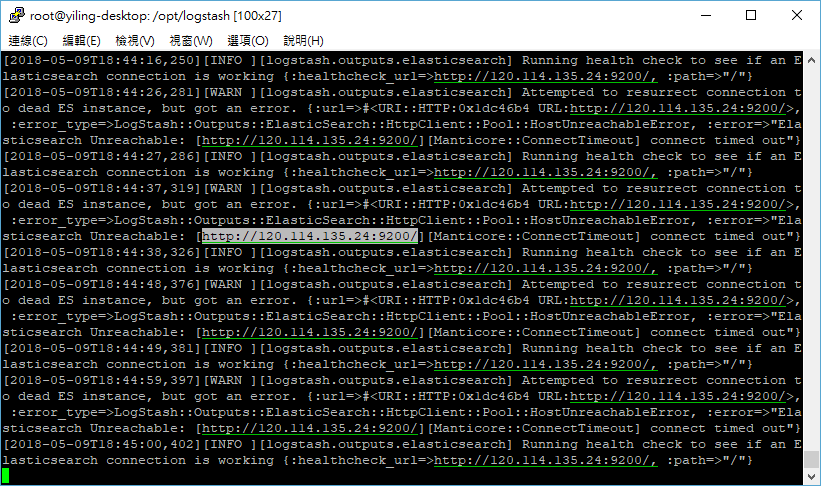 
### 在網頁輸入網址 `http://120.114.135.24:9200/_search?q=DVWA` 
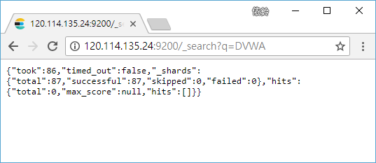 
### 在網頁輸入網址 `http://localhost:5601/app/kibana#/discover?_g=()` 
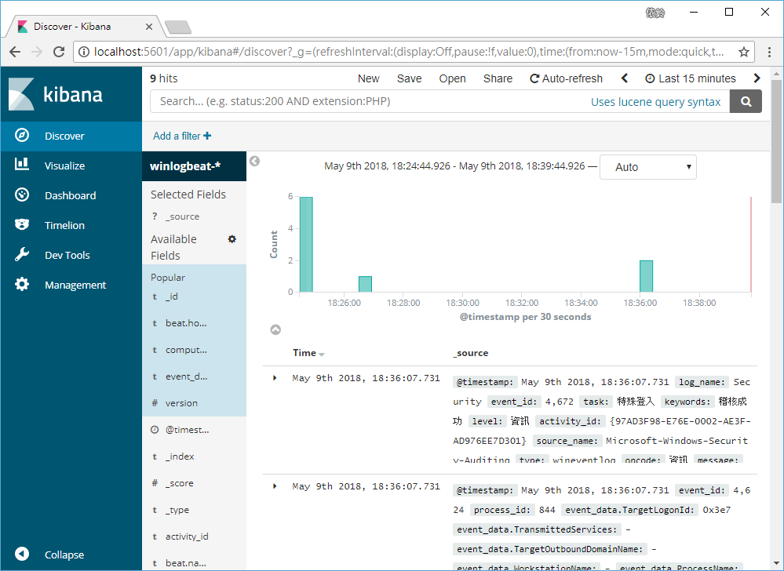 
